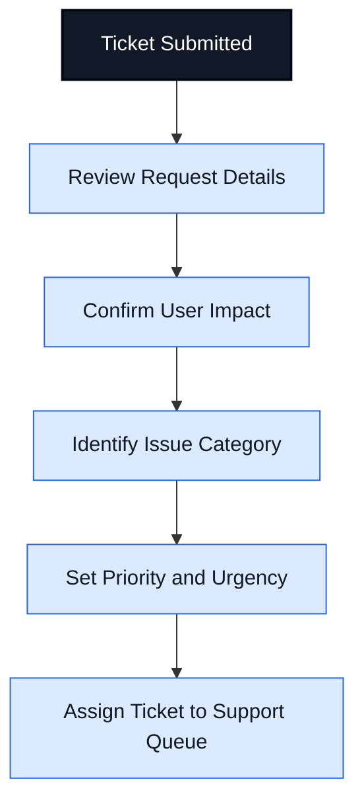
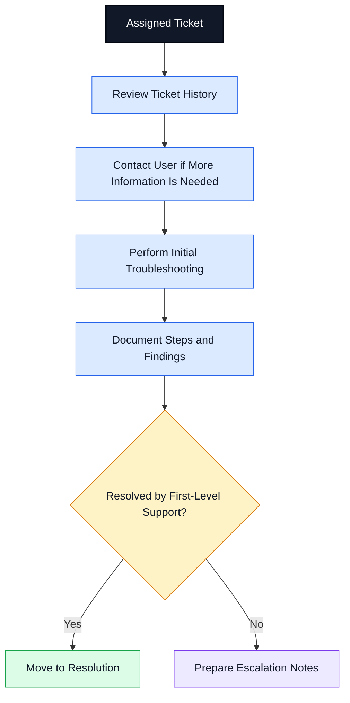
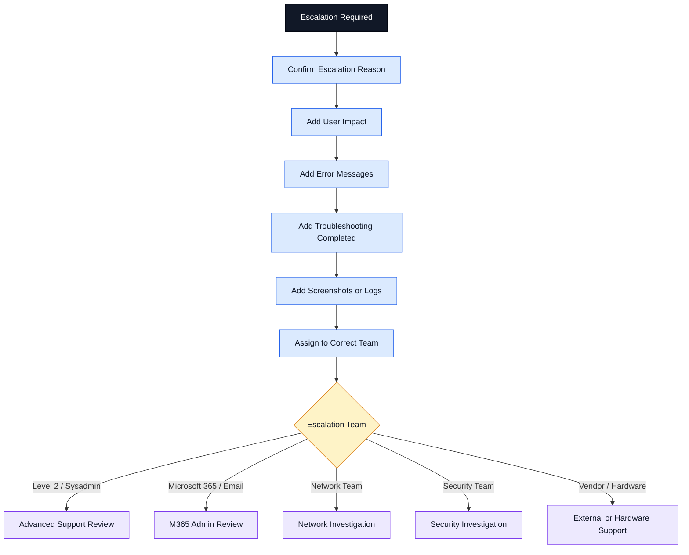
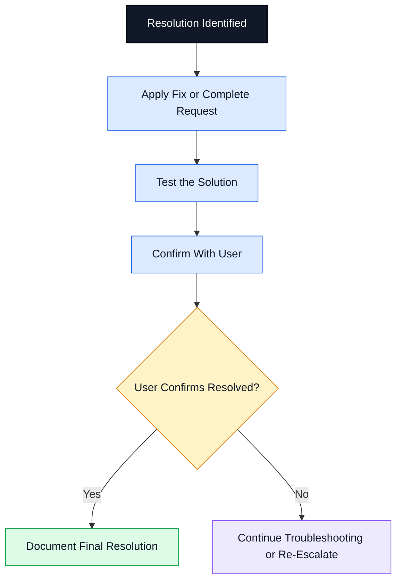
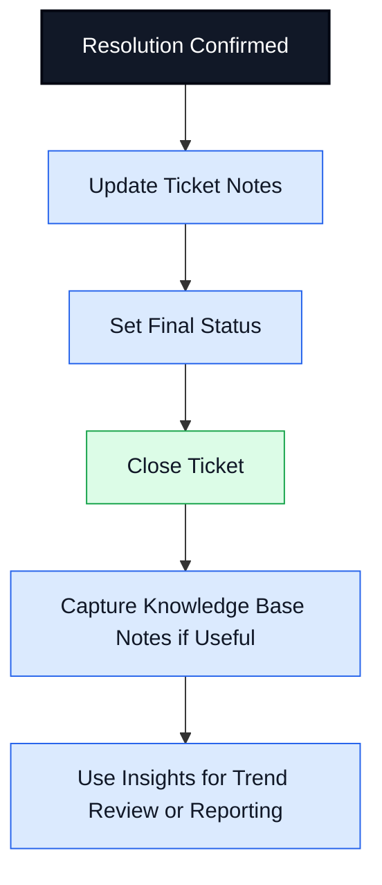
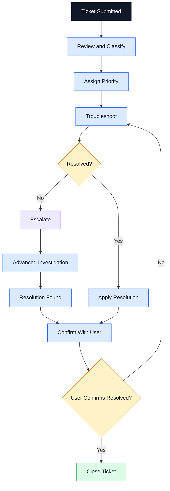

# Ticket Lifecycle Diagram

## Purpose

This document shows a professional IT support ticket lifecycle for help desk and service desk environments. It is split into smaller readable diagrams so it displays clearly on GitHub without needing to zoom in.

---

# 1. Ticket Intake and Classification

## What Happens at This Stage

- User submits an issue or request
- Help desk reviews the ticket
- Category is identified
- Priority is assigned
- Ticket is routed to the correct queue

## Common Ticket Categories

| Category | Examples |
|---|---|
| Account Support | Password reset, lockout, MFA |
| Email Support | Outlook issue, mailbox access |
| Desktop Support | Slow computer, software issue |
| Network Support | Wi-Fi, VPN, DNS, connectivity |
| Hardware Support | Printer, laptop, monitor |
| Access Request | Shared folder, mailbox, app access |

---

# 2. Investigation and Troubleshooting

## Troubleshooting Notes Should Include

- What the user reported
- Error messages
- What was tested
- Results of each step
- Screenshots or logs if available
- Whether the issue affects one user or multiple users

---

# 3. Escalation Workflow

## Common Escalation Triggers

- Issue requires admin permissions
- Multiple users are affected
- Business-critical service is down
- Security concern or suspicious activity
- Level 1 troubleshooting did not resolve the issue
- Hardware replacement or vendor support is needed

---

# 4. Resolution and User Confirmation

## Good Resolution Notes Include

- Root cause or likely cause
- Troubleshooting steps completed
- Final fix applied
- User confirmation
- Follow-up actions if needed

---

# 5. Ticket Closure and Knowledge Capture

## Why This Matters

A strong ticket lifecycle helps support teams:

- Improve documentation quality
- Resolve issues faster
- Escalate more effectively
- Track user impact
- Build a knowledge base
- Identify recurring problems

---

# 6. Full Ticket Lifecycle Summary

---

# Example Ticket Status Flow

| Stage | Typical Status |
|---|---|
| Ticket created | New |
| Under review | Open |
| Assigned to support | In Progress |
| Waiting for user | Pending User |
| Escalated | Escalated |
| Fix applied | Resolved |
| User confirmed | Closed |

---

# Portfolio Note

This diagram is part of an IT Support Ticket Documentation project designed to demonstrate help desk workflow knowledge, escalation handling, troubleshooting documentation, and service desk best practices.

## Disclaimer

This is a learning and portfolio documentation sample. It does not contain real customer data, private company information, or actual ticketing system records.
